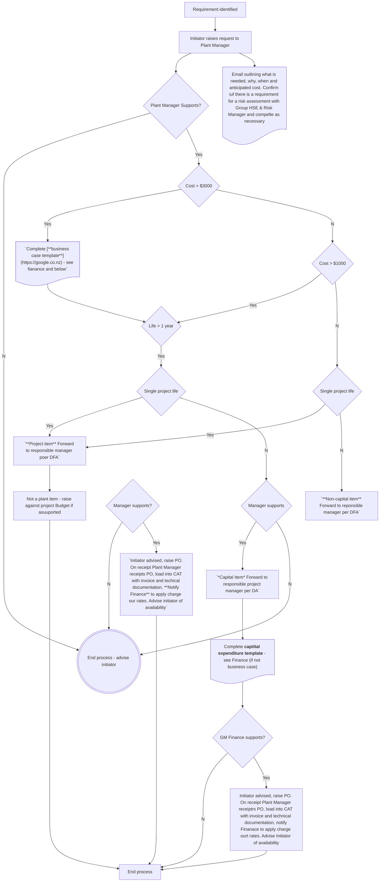

POL-000031
{: .label .label-green}

# Plant & Equipment

## 32.1 Purpose and Scope

This policy outlines the key principles and approaches to plant & equipment management. All Employees of the Company must ensure that plant & equipment are effectively and sustainably managed at the optimal whole of lifecycle cost, along with minimisation of waste.

## 32.2 Definition of Plant and Equipment

Plant and equipment are any items purchased that will not be immediately consumed on use and will be used over several projects. Common examples are electrical tools, lifeguards, hoardings, scaffolding, ladders, shovels, etc.

{: .highlight-title}
*PROCEDURES*: <inc>SharePoint/Library/Procedures</inc>: flowchart, business case, expenditure, and incident report.

## 32.3Entry into CAT Projects

All plant and equipment purchased are to be registered in CAT Projects as managed plant and ‘hired’ to projects as required. The only exception is items that are purchased specifically for use on a project which is not expected to have a life beyond that project – in these cases, the full purchase price will be charged to the project as a standard construction cost.

Note that before purchase, the Initiator of the request should confirm if there is a requirement for a risk assessment with the Group HSE & Risk Manager.

Further to this, any item of plant over $3,000 in value requires a business case to be submitted to the GM Finance for sign-off before purchase, as per the Delegated Authority Policy (DAP). Please contact Finance to complete a business case and acquire approval from the GM Finance.

Each region has a staff member fulfilling the function of a Plant Manager – if an employee is unsure of who this person is they should consult their manager. Before any item of plant is purchased, the Plant Manager is to ensure there is not already an available item of plant that can meet the need, or a suitable alternative to purchase.

## 32.4 Plant Repairs & Maintenance

If an item of the plant requires repair or maintenance, the Plant Manager must be consulted before repair. This enables visibility of how frequently an item is failing and if it may need replacement. It also allows the identification of any repairs that might be under warranty.

## 32.5 Disposing of Plant

The CCO and GM Finance are the sole authority for the disposal of the plant. Any defective plant deemed non- repairable will be referred to the Plant Manager, who will determine whether it is to be repaired or disposed of and consult the CCO and GM Finance if the disposal is recommended. This includes loss of plant as per the plant & equipment procedure.

## 32.6 Loss of Plant

If any plant is lost, stolen, or damaged, an Incident Report is to be completed and immediately advised to the reporting employees’ manager. Instances of theft will be investigated and will require Police involvement. A copy of the Incident Report and a police report will be required to be filed with any subsequent insurance claim, so a copy should be forwarded to Finance.

## 32.7 Flowchart

## 32.8 Initial Requirements for Business Case and Capital Expenditure

**Send to Finance:**

| **Request Information**                                                               | Values                    |
|-----------------------	                                                            | --------------------------|
| Date requested                                                                        | _dd-MMM-yy                |
| Date item required                                                                    | _dd-MMM-yy_               |
| Name of requestor                                                                     | _Name_                    |
| Manager of requestor                                                              	| _Manager_                 |
| What business unit will acquire the item?                                         	| _Business unit name_      |
| What project will the item be for initially?                                      	| _Project_                 |
| Is the item likely to be used on another project as well?                         	| _No/Yes, Project X_       |
| Have you confirmed requirement for risk assessment with Group HSE & Risk Manager? 	| _Yes/No, reason for no_   |
|                                                                                   	|                           |
| **Item Information**  	                                                            |                           |
| Classification                                                                    	| _Enter_                   |
| Make                                                                              	| _Enter_                   |
| Model                                                                             	| _Enter_                   |
| Description                                                                       	| _Enter_                   |
| Estimated useful life (years)                                                     	| _Enter_                   |
| Estimated utilisation (what % of time will it be in use?)                         	| _Enter_                   |
| Estimated annual maintenance costs                                                	| _Enter_                   |
| Estimated annual licencing/subscription or related costs                          	| _Enter_                   |
|                                                                                   	|                           |
| **Other information** 	                                                            |                           |
| Why is this item needed?                                                          	| _Enter_                   |
| Is there an alternative to achieve the function?                                      | _Enter_                   |
| Alternative Options available                                                         | _(e.g., Hire)_            |
| Estimated annual cost                                                                 |                           |
| _Example: Hire from Hirepool for the project duration_                                | _2,000_                   |
| _Item 2_                                                                              | _$_                       |
| Supplier information (2 x quotes required)                                            | _Quote_                   |
|                                                                                       |                           |
| **Other comments:**                                                                   |                           |

## 32.9 Incident Report

### Missing / Damaged Plant

**Please attach any pertinent documents, e.g., police reports and photos.**

Date: _dd-MMM-yy_
	
Name: ____________________________________________________________

Plant Number and Name:____________________________________________
 
Details/ Comments (Where was it last seen, where was it misplaced from, what happened, etc.)
____________________________________________________________________________________

{: .lookatme}
Signed (Project Manager)
> 
>

_This form should also be submitted to the relevant Regional Manager and, in cases of lost or stolen plant, to Finance._

<iframe src=".\pol_assests\3rd Test policy.pdf" 
        width="100%" 
        height="800px" 
        style="border: none;">
        
</iframe>

<iframe src="../pol_assests/3rd Test policy.pdf#zoom=100" 
        width="100%" 
        height="1000px"
        style="border: none; max-width: 100%;"
        frameborder="0">
  Your browser does not support PDFs. 
  <a href="../pol_assests/3rd Test policy.pdf">Download the PDF</a> instead.
</iframe>

	
